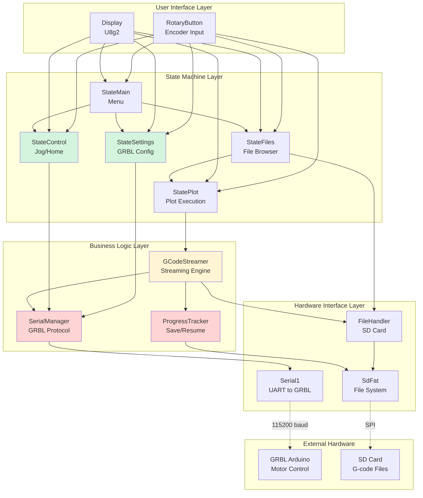

# Pen Plotter Controller Brownfield Enhancement Architecture

## Introduction

This document outlines the architectural approach for enhancing **Pen Plotter Controller** with **complete serial GRBL communication, display integration, plot state management, settings management, and jog control functionality**. Its primary goal is to serve as the guiding architectural blueprint for AI-driven development of new features while ensuring seamless integration with the existing system.

**Relationship to Existing Architecture:**
This document defines the architecture for completing a partially implemented Arduino-based plotter controller. The existing codebase includes working display, rotary encoder, SD card file browsing, and drafted (but untested) GCodeStreamer and StatePlot classes. This architecture establishes how to validate, integrate, and complete these components into a production-ready system.

### Existing Project Analysis

#### Current Project State
- **Primary Purpose:** Standalone Arduino-based G-code streaming controller for DIY pen plotter
- **Current Tech Stack:** Arduino (MKR WiFi 1010), C++, PlatformIO, U8g2 (display), SdFat (SD card)
- **Architecture Style:** State machine architecture with enum-based state management
- **Deployment Method:** PlatformIO build and upload to Arduino hardware

#### Available Documentation
- ✅ Project Brief (`docs/brief.md`) - Comprehensive problem statement and solution approach
- ✅ Brownfield PRD (`docs/prd.md`) - Detailed requirements for enhancement
- ❌ Architecture documentation - Does not exist (this document will create it)
- ❌ API documentation - No formal documentation of class interfaces
- ❌ Testing documentation - No test plans or validation procedures

#### Identified Constraints
- **Hardware:** Arduino MKR WiFi 1010 (32KB SRAM, 256KB Flash) - memory constraints
- **Communication:** Hardware Serial1 for GRBL at 115200 baud - single serial channel
- **Display:** 128x64 OLED via U8g2 - limited screen real estate, text-only interface
- **Storage:** SD card via SdFat - file system operations must be efficient
- **Untested Code:** GCodeStreamer and StatePlot classes have never been validated against hardware
- **Power:** Standalone operation - must handle power interruptions gracefully
- **User Interface:** Rotary encoder only - no keyboard/touchscreen for complex input

### Change Log
| Change | Date | Version | Description | Author |
|--------|------|---------|-------------|--------|
| Initial Architecture | 2025-11-25 | 1.0 | Created brownfield architecture for plotter controller MVP | Winston (Architect) |

## Enhancement Scope and Integration Strategy

#### Enhancement Overview
**Enhancement Type:** Brownfield - Validation and Completion

**Scope:** Complete the MVP by validating untested streaming logic, implementing missing serial communication and display integration, adding settings and jog control states

**Integration Impact:** Significant - Affects main.cpp initialization, all state classes for display integration, new serial communication layer touches multiple components

#### Integration Approach

**Code Integration Strategy:** 
- Extend existing state machine with two new states (SETTINGS, CONTROL)
- Integrate serial communication into main.cpp setup and existing GCodeStreamer
- Refactor all state classes to use OLED display instead of Serial debug output
- Validate and potentially refactor GCodeStreamer and StatePlot based on hardware testing

**Database Integration:** 
- N/A - No database, using SD card file system via SdFat library
- File-based progress persistence (.progress files alongside .gcode files)

**API Integration:** 
- Serial API to GRBL firmware (115200 baud, wait-for-ok protocol)
- GRBL command set: G-code streaming, $$ (query settings), $X=value (set settings), $H (homing), Jog commands
- GRBL response parsing for ok/error/alarm messages

**UI Integration:** 
- Replace all existing Serial.println() debug output with U8g2 display calls
- Maintain existing rotary encoder interface pattern (rotate for navigation, press for selection)
- Ensure consistent menu navigation across all 5 states (MAIN, FILES, PLOT, SETTINGS, CONTROL)

#### Compatibility Requirements

**Existing API Compatibility:** 
- Must maintain existing FileHandler API - state_files depends on it
- Must preserve RotaryButton API - all states use it
- Display module must expose consistent interface for all states

**Database Schema Compatibility:** 
- N/A (file system only)
- Progress file format: plain text with filename, line number, timestamp

**UI/UX Consistency:** 
- All states must follow established 3-item menu display pattern
- Rotary encoder behavior must be consistent (long-press for back/cancel)
- Status messages must use consistent formatting and positioning

**Performance Impact:** 
- Serial communication at 115200 baud must not block display updates
- SD card writes for progress tracking must complete within acceptable latency (<100ms per write)
- Display refresh rate must maintain responsiveness (aim for 10+ fps during streaming)
- Memory footprint must stay within 32KB SRAM limit (monitor with build size reporting)

## Tech Stack Alignment

#### Existing Technology Stack

| Category | Current Technology | Version | Usage in Enhancement | Notes |
|----------|-------------------|---------|---------------------|-------|
| **Platform** | Arduino (ATmega SAMD21) | MKR WiFi 1010 | Core platform - all code runs here | 32KB SRAM, 256KB Flash constraints |
| **Framework** | Arduino Framework | Latest via PlatformIO | All firmware development | Provides hardware abstraction |
| **Build System** | PlatformIO | Latest | Build, upload, dependency management | Replaces Arduino IDE |
| **Display Library** | U8g2 | 2.36.15 | All UI rendering | Monochrome OLED, text and graphics |
| **SD Card Library** | SdFat (Adafruit Fork) | 2.3.54 | File browsing, G-code reading, progress persistence | FAT32 file system |
| **Serial Communication** | Arduino Hardware Serial | Built-in | GRBL communication via Serial1 | 115200 baud, hardware UART |
| **Language** | C++ | C++11 (Arduino compatible) | All source code | Limited STL, no exceptions |
| **State Management** | Enum-based State Machine | Custom | Existing pattern to extend | States: MAIN, FILES, PLOT, SETTINGS, CONTROL |

#### New Technology Additions

**No new external technologies required.** All enhancement work uses the existing tech stack:

- Serial1 hardware UART (already available on MKR WiFi 1010)
- U8g2 library (already integrated)
- SdFat library (already integrated)
- Standard Arduino libraries for timing and utilities

**Rationale:** 
- Minimizes dependencies and reduces memory footprint
- Leverages proven libraries already in use
- Avoids introduction of new points of failure
- Simplifies testing and debugging on constrained hardware

## Data Models and Schema Changes

#### New Data Models

Since this is an embedded system without a traditional database, our "data models" are C++ classes and structures representing runtime state and persistent file formats.

##### Model 1: GCodeStreamer (Existing - Requires Validation)

**Purpose:** Stream G-code files line-by-line to GRBL with flow control and progress tracking

**Integration:** Core component used by StatePlot; interfaces with Serial1 and SdFat

**Key Attributes:**
- `File currentFile`: SdFat file handle for open G-code file
- `unsigned long currentLine`: Current line number in file
- `unsigned long totalLines`: Total lines in file (for progress calculation)
- `StreamState state`: Enum (IDLE, STREAMING, PAUSED, ERROR, COMPLETE)
- `char lineBuffer[128]`: Buffer for current G-code line
- `bool waitingForOk`: Flow control flag - waiting for GRBL acknowledgment

**Relationships:**
- **With Existing:** Used by StatePlot class; reads from FileHandler-selected files
- **With New:** Communicates via Serial1 with GRBL; writes progress via new ProgressTracker

##### Model 2: ProgressTracker (New)

**Purpose:** Persist plot progress to SD card for resume-after-power-loss functionality

**Integration:** Used by GCodeStreamer to save state; queried by StatePlot on initialization

**Key Attributes:**
- `String progressFileName`: Generated from .gcode filename (e.g., "plot.gcode.progress")
- `String sourceFileName`: Original G-code file name
- `unsigned long savedLine`: Last successfully completed line number
- `unsigned long timestamp`: Milliseconds since start (for debugging)

**Relationships:**
- **With Existing:** Writes to SD card via SdFat; filename derived from FileHandler selection
- **With New:** Created/updated by GCodeStreamer; read by StatePlot for resume detection

##### Model 3: GRBLSettings (New)

**Purpose:** Store and manage GRBL configuration parameters for settings state

**Integration:** Used by StateSettings for display and modification

**Key Attributes:**
- `struct Setting { int number; String name; String value; String unit; }`: Individual setting representation
- `Setting settings[27]`: Array of GRBL settings ($0-$26)
- `bool settingsLoaded`: Flag indicating if settings have been queried from GRBL
- `int selectedSetting`: Currently selected setting for modification

**Relationships:**
- **With Existing:** Displayed via U8g2; navigated via RotaryButton
- **With New:** Populated by querying GRBL via Serial1; modified settings sent back to GRBL

##### Model 4: JogController (New)

**Purpose:** Manage manual axis positioning (jog) commands to GRBL

**Integration:** Used by StateControl for X/Y axis movement

**Key Attributes:**
- `enum Axis { X_AXIS, Y_AXIS }`: Selected axis for jogging
- `float jogDistance`: Distance to jog (e.g., 0.1, 1.0, 10.0 mm)
- `int jogSpeed`: Feedrate for jog movement (mm/min)
- `enum Direction { POSITIVE, NEGATIVE }`: Jog direction

**Relationships:**
- **With Existing:** Displayed via U8g2; controlled via RotaryButton
- **With New:** Sends jog commands to GRBL via Serial1

#### Schema Integration Strategy

**File System Changes Required:**

**New Files Created:**
- `*.gcode.progress`: Progress tracking files (one per plot, deleted on completion)
  - Format: Plain text, one line: `filename,lineNumber,timestamp`
  - Example: `dragon.gcode,1523,45821`

**Modified Files:** None (all operations are file creation or reading)

**New Indexes:** N/A (file system only, no indexing)

**Migration Strategy:** 
- No migration needed - new files are created as needed
- Existing .gcode files on SD card work without modification
- Old .progress files (if any) can be manually deleted or ignored

**Backward Compatibility:**
- Existing SD card structure and .gcode files remain fully compatible
- Controller can operate with SD cards used in previous firmware versions
- Progress file feature is additive - doesn't break existing functionality

## Component Architecture

#### New Components

##### Component 1: SerialManager

**Responsibility:** Manage bidirectional serial communication with GRBL, handle protocol flow control, parse responses

**Integration Points:** 
- Used by GCodeStreamer for G-code transmission
- Used by StateSettings for settings queries and updates
- Used by StateControl for jog commands and homing
- Reads/writes via Hardware Serial1

**Key Interfaces:**
- `bool begin(unsigned long baud)`: Initialize serial communication
- `bool sendLine(const char* line)`: Send G-code line and wait for ok/error
- `bool waitForOk(unsigned int timeout_ms)`: Block until GRBL responds with ok
- `String getLastResponse()`: Retrieve last response from GRBL
- `GRBLStatus parseStatus(String response)`: Parse GRBL status/error messages
- `bool isReady()`: Check if GRBL is ready to receive commands

**Dependencies:**
- **Existing Components:** None (standalone utility)
- **New Components:** Used by GCodeStreamer, StateSettings, StateControl

**Technology Stack:** Arduino Serial1 (hardware UART), C++ String parsing

##### Component 2: GCodeStreamer (Existing - Enhanced)

**Responsibility:** Stream G-code files to GRBL with flow control, progress tracking, pause/resume capability

**Integration Points:**
- Invoked by StatePlot during plot execution
- Uses SerialManager for GRBL communication
- Uses ProgressTracker for save/resume functionality
- Reads files via FileHandler/SdFat

**Key Interfaces:**
- `bool startStream(const char* filename)`: Begin streaming a G-code file
- `void pauseStream()`: Pause streaming (holds current position)
- `void resumeStream()`: Resume from pause
- `void cancelStream()`: Abort stream and clean up
- `StreamStatus getStatus()`: Get current stream state (idle/streaming/paused/error/complete)
- `float getProgress()`: Get completion percentage (0.0 - 100.0)
- `bool update()`: Call from main loop to process streaming (non-blocking)

**Dependencies:**
- **Existing Components:** FileHandler (file selection), Display (status output)
- **New Components:** SerialManager (GRBL communication), ProgressTracker (persistence)

**Technology Stack:** SdFat for file I/O, SerialManager for GRBL protocol

##### Component 3: ProgressTracker (New)

**Responsibility:** Persist and restore plot progress for power-loss recovery

**Integration Points:**
- Used by GCodeStreamer to save progress periodically
- Queried by StatePlot on initialization to detect incomplete plots
- Writes to SD card via SdFat

**Key Interfaces:**
- `bool saveProgress(const char* filename, unsigned long lineNum)`: Save current progress
- `bool loadProgress(const char* filename, unsigned long& outLineNum)`: Load saved progress
- `bool hasProgress(const char* filename)`: Check if progress file exists
- `void clearProgress(const char* filename)`: Delete progress file (on completion/cancel)

**Dependencies:**
- **Existing Components:** SdFat library for file operations
- **New Components:** Used by GCodeStreamer

**Technology Stack:** SdFat for .progress file read/write

##### Component 4: StateSettings (New)

**Responsibility:** Display and modify GRBL configuration settings via menu interface

**Integration Points:**
- State machine component (accessed via MAIN menu)
- Uses SerialManager to query/update GRBL settings
- Uses Display and RotaryButton for UI

**Key Interfaces:**
- `void enter()`: Enter settings state (query current settings from GRBL)
- `void update()`: Handle rotary encoder input and display updates
- `void exit()`: Exit to main menu

**Dependencies:**
- **Existing Components:** Display, RotaryButton, state machine framework
- **New Components:** SerialManager (GRBL communication)

**Technology Stack:** U8g2 for display, SerialManager for GRBL $$ queries

##### Component 5: StateControl (New)

**Responsibility:** Manual jog control and homing operations

**Integration Points:**
- State machine component (accessed via MAIN menu)
- Uses SerialManager for jog commands and homing
- Uses Display and RotaryButton for UI

**Key Interfaces:**
- `void enter()`: Enter control state
- `void update()`: Handle rotary encoder input for jog operations
- `void exit()`: Exit to main menu

**Dependencies:**
- **Existing Components:** Display, RotaryButton, state machine framework
- **New Components:** SerialManager (jog commands, $H homing)

**Technology Stack:** U8g2 for display, SerialManager for GRBL jog protocol

#### Component Interaction Diagram



## Source Tree Integration

#### Existing Project Structure

```
plotterController/
├── platformio.ini              # PlatformIO configuration
├── docs/
│   ├── brief.md                # Project brief
│   └── prd.md                  # Brownfield PRD
├── include/                    # Header files
│   ├── README
│   ├── display.h               # Display utilities (existing)
│   ├── FileHandler.h           # SD card file browser
│   ├── globals.h               # Global state and enums
│   ├── RotaryButton.h          # Rotary encoder handler
│   ├── gcode_streamer.h        # G-code streaming (UNTESTED)
│   ├── state_main.h            # Main menu state
│   ├── state_control.h         # Control state (DRAFT)
│   ├── state_settings.h        # Settings state (DRAFT)
│   ├── state_files.h           # File browser state
│   └── state_plot.h            # Plot execution state (UNTESTED)
├── src/                        # Implementation files
│   ├── main.cpp                # Entry point and main loop
│   ├── display.cpp             # Display utilities implementation
│   ├── FileHandler.cpp         # File browser implementation
│   ├── globals.cpp             # Global state implementation
│   ├── RotaryButton.cpp        # Encoder implementation
│   ├── gcode_streamer.cpp      # Streaming implementation (UNTESTED)
│   ├── state_main.cpp          # Main menu implementation
│   ├── state_control.cpp       # Control state (DRAFT)
│   ├── state_settings.cpp      # Settings state (DRAFT)
│   ├── state_files.cpp         # File browser implementation
│   └── state_plot.cpp          # Plot state (UNTESTED)
├── lib/                        # Custom libraries (empty)
│   └── README
└── test/                       # Test files (empty)
    └── README
```

#### New File Organization

```
plotterController/
├── platformio.ini              # No changes
├── docs/
│   ├── brief.md                # Existing
│   ├── prd.md                  # Existing
│   ├── architecture.md         # NEW - This document
│   ├── architecture/           # NEW - Sharded architecture sections
│   │   ├── tech-stack.md       # NEW - Technology stack reference
│   │   ├── coding-standards.md # NEW - Coding conventions
│   │   └── source-tree.md      # NEW - File organization guide
│   ├── prd/                    # NEW - Sharded PRD sections
│   └── stories/                # NEW - User stories (created by SM)
├── include/
│   ├── (existing files remain unchanged)
│   ├── serial_manager.h        # NEW - GRBL serial protocol handler
│   └── progress_tracker.h      # NEW - Progress persistence
├── src/
│   ├── main.cpp                # MODIFIED - Add Serial1 initialization
│   ├── (existing files)        # MODIFIED - Replace Serial with Display
│   ├── gcode_streamer.cpp      # MODIFIED - Integration with SerialManager
│   ├── state_control.cpp       # MODIFIED - Implement jog/home functionality
│   ├── state_settings.cpp      # MODIFIED - Implement settings query/modify
│   ├── state_plot.cpp          # MODIFIED - Display integration
│   ├── serial_manager.cpp      # NEW - SerialManager implementation
│   └── progress_tracker.cpp    # NEW - ProgressTracker implementation
├── .ai/                        # NEW - AI development tracking
│   └── debug-log.md            # NEW - Development debug log
├── lib/                        # Unchanged
└── test/                       # Future: Add unit tests
```

#### Integration Guidelines

**File Naming:**
- Headers: `lowercase_with_underscores.h` (existing pattern)
- Implementation: `lowercase_with_underscores.cpp` (existing pattern)
- Classes: `PascalCase` (e.g., `GCodeStreamer`, `SerialManager`)
- State functions: `state_lowercase()` (existing pattern)

**Folder Organization:**
- All headers in `include/` (existing pattern - no subdirectories)
- All implementations in `src/` (existing pattern - no subdirectories)
- Documentation in `docs/` with sharded subdirectories per BMad convention
- AI development artifacts in `.ai/` (not tracked in version control)

**Import/Export Patterns:**
- Headers use include guards: `#ifndef FILENAME_H` / `#define FILENAME_H` (existing pattern)
- Global objects declared in `globals.h`, defined in `globals.cpp` (existing pattern)
- State functions declared in `state_*.h`, implemented in `state_*.cpp` (existing pattern)
- New components follow same pattern: declare in header, implement in .cpp

**Critical Integration Notes:**
- `main.cpp` must initialize `Serial1.begin(115200)` in `setup()` for GRBL communication
- All existing `Serial.println()` debug output must be removed or replaced with Display calls
- State functions remain in global namespace (not classes) per existing architecture
- New SerialManager and ProgressTracker are instantiated as global singletons in `globals.h/cpp`

## Coding Standards and Conventions

#### Existing Standards Compliance

**Code Style:**
- Indentation: 2 spaces (no tabs) - observed in all existing files
- Braces: Opening brace on same line for functions and control structures
- Line length: No strict limit observed, pragmatic approach (~100-120 chars common)
- Comments: C++ style (`//`) for single-line, C style (`/* */`) for blocks
- Naming: Mixed - `camelCase` for variables, `PascalCase` for classes, `snake_case` for files

**Linting Rules:**
- No formal linter configured in platformio.ini
- Compiler warnings enabled by default in PlatformIO
- Recommendation: Add `-Wall -Wextra` to platformio.ini for enhanced warnings

**Testing Patterns:**
- No existing tests (test/ directory empty)
- Testing strategy: Hardware validation with physical plotter
- Future: Add unit tests for critical components (GCodeStreamer, SerialManager)

**Documentation Style:**
- Inline comments for complex logic (sparse in current code)
- Header comments with purpose/responsibility statements
- No Doxygen or formal API documentation
- This architecture document serves as primary design reference

#### Enhancement-Specific Standards

**Memory Management:**
- **Minimize dynamic allocation**: Avoid `new`/`delete` where possible due to heap fragmentation risk on Arduino
- **Prefer stack allocation**: Use fixed-size arrays and stack objects
- **Exception**: Dynamic allocation acceptable in state enter/exit for temporary data (see state_files.cpp pattern)
- **String usage**: Minimize Arduino String class usage; prefer C strings (`char[]`) for better memory control
- **Buffer sizing**: Define buffer sizes as constants, never magic numbers

**Serial Communication:**
- **Non-blocking I/O**: Never block indefinitely waiting for Serial data
- **Timeouts**: All serial operations must have timeout (recommend 1000ms for GRBL responses)
- **Error handling**: Always check return values from Serial reads/writes
- **Response parsing**: Use `readStringUntil('\n')` for GRBL line-based protocol
- **Flow control**: Respect GRBL's ok/error responses before sending next command

**Display Updates:**
- **Frame buffering**: Use U8g2's full buffer mode (`_F_` variants) for flicker-free rendering
- **Update frequency**: Limit display updates to ~10-60 Hz (avoid excessive redraws)
- **Display pattern**: `u8g2.clearBuffer()` → draw operations → `u8g2.sendBuffer()`
- **Text formatting**: Use U8g2's built-in text functions, avoid manual character positioning

**Error Handling:**
- **Return status codes**: Functions return `bool` for success/failure where appropriate
- **Enum status types**: Use enums (e.g., `GCodeStatus`) for multi-state status
- **Graceful degradation**: Display errors to user via OLED, don't silently fail
- **No exceptions**: Arduino doesn't support C++ exceptions; use return codes only

**State Management:**
- **State activation flag**: Each state uses `static bool state_active` pattern (see state_files.cpp)
- **Reset on entry**: Initialize state when `state_active == false`
- **Cleanup on exit**: Free allocated memory, reset encoder position
- **State transition**: Set `currentState` enum, let main loop handle transition

#### Critical Integration Rules

**Existing API Compatibility:**
- **FileHandler interface**: Do not modify `getFileName()`, `getFileCount()`, `loadFileNames()` signatures
- **RotaryButton interface**: Preserve `getPosition()`, `setPosition()`, `turned()`, `pressed()` API
- **Display utilities**: Maintain `displayList()` function signature for menu rendering
- **Global state**: Keep `currentState` enum in `globals.h`, state enum values unchanged

**Serial Communication Integration:**
- **Serial port allocation**: Serial1 is GRBL only, never use for debug output
- **Serial initialization**: `Serial1.begin(115200)` in `main.cpp setup()` before any state that needs GRBL
- **Remove debug Serial**: Replace all `Serial.println()` with display output or remove entirely
- **Serial availability check**: Use `Serial1.available()` before reading, never block

**Error Handling Integration:**
- **GRBL error display**: Parse GRBL error messages and display on OLED in human-readable format
- **SD card errors**: Display "SD Error" message if file operations fail, return to FILES state
- **Serial timeout**: Display "GRBL Not Ready" if SerialManager.isReady() returns false
- **Progress file corruption**: If progress file corrupted, delete it and offer fresh start

**Logging Consistency:**
- **No Serial logging**: Cannot use Serial for logging (Serial1 is GRBL communication)
- **Display-based feedback**: All status messages go to OLED display
- **Development logging**: Use `.ai/debug-log.md` for development notes and findings
- **Progress tracking**: Progress files provide persistent debugging info (timestamps, line numbers)

#### Code Example - Standard Pattern

**State Function Pattern:**
```cpp
// state_example.h
#ifndef STATE_EXAMPLE_H
#define STATE_EXAMPLE_H

void state_example();
void example_menuSelect(int index);

#endif

// state_example.cpp
#include "state_example.h"
#include "globals.h"
#include "display.h"

bool example_active = false;

void state_example() {
  static String* menuItems = nullptr;
  static int itemCount = 3;
  
  // Initialize state on first entry
  if (!example_active) {
    encoder.setPosition(0);
    menuItems = new String[itemCount];
    menuItems[0] = "<- Back";
    menuItems[1] = "Option 1";
    menuItems[2] = "Option 2";
    displayList(encoder.getPosition(), menuItems, itemCount);
    example_active = true;
  }
  
  // Handle encoder input
  if (encoder.turned()) {
    encoder.constrainPosition(0, itemCount - 1);
    displayList(encoder.getPosition(), menuItems, itemCount);
  }
  
  if (encoder.pressed()) {
    example_menuSelect(encoder.getPosition());
  }
}

void example_menuSelect(int index) {
  if (index == 0) {
    currentState = MAIN;
    example_active = false;
  }
  // Handle other selections...
}
```

**Non-blocking Serial Pattern:**
```cpp
bool SerialManager::sendLine(const char* line) {
  Serial1.println(line);
  return waitForOk(1000); // 1 second timeout
}

bool SerialManager::waitForOk(unsigned int timeout_ms) {
  unsigned long startTime = millis();
  while (millis() - startTime < timeout_ms) {
    if (Serial1.available()) {
      String response = Serial1.readStringUntil('\n');
      if (response.startsWith("ok")) {
        return true;
      } else if (response.startsWith("error")) {
        _lastError = response;
        return false;
      }
    }
  }
  return false; // Timeout
}
```

## Testing Strategy

#### Integration with Existing Tests

**Existing Test Framework:** 
- No formal test framework currently configured
- test/ directory exists but is empty
- All validation has been manual/hardware-based

**Test Organization:** 
- Future tests will reside in `test/` directory per PlatformIO convention
- PlatformIO supports native tests (run on host) and embedded tests (run on target)
- Recommendation: Start with embedded tests that run on actual hardware

**Coverage Requirements:**
- No formal coverage metrics currently defined
- Recommendation: Focus on critical path testing (GRBL communication, streaming, progress persistence)
- Target: 80%+ coverage of SerialManager and GCodeStreamer logic paths

#### New Testing Requirements

##### Unit Tests for New Components

**Framework:** 
- PlatformIO's built-in Unity test framework (embedded tests on target hardware)
- Alternative: AUnit for Arduino-specific assertions

**Location:** 
- `test/test_serial_manager/` - SerialManager tests
- `test/test_gcode_streamer/` - GCodeStreamer tests
- `test/test_progress_tracker/` - ProgressTracker tests

**Coverage Target:** 
- Critical components (SerialManager, GCodeStreamer): 80%+ line coverage
- State functions: Manual validation preferred (requires full UI interaction)
- Utility functions: 60%+ coverage

**Integration with Existing:**
- Tests will initialize same hardware as main.cpp (Serial1, SD, display)
- Can reuse existing global objects (encoder, SD, u8g2)
- Mock GRBL responses for SerialManager testing (loopback or simulated device)

**Testing Challenges:**
- **Hardware dependency**: Tests require physical Arduino, SD card, and ideally GRBL device
- **Serial mocking**: Need strategy to test SerialManager without real GRBL (loopback cable or mock firmware)
- **Timing-sensitive code**: GCodeStreamer has timing requirements that may be hard to test deterministically
- **Display validation**: Can't automatically verify display output - manual inspection required

##### Integration Tests

**Scope:**
- End-to-end flow: Select file → Start plot → Stream to GRBL → Complete/resume
- State transitions: Verify all state machine transitions work correctly
- Error recovery: Test pause/resume, power loss recovery, GRBL error handling

**Existing System Verification:**
- Verify FileHandler still lists files correctly after SerialManager added
- Verify RotaryButton behavior unchanged in all states
- Verify display rendering performance maintained during streaming
- Verify SD card read performance not degraded by progress file writes

**New Feature Testing:**
- **Serial communication**: Send commands to GRBL, verify responses parsed correctly
- **Streaming**: Stream sample G-code file, verify all lines transmitted
- **Progress persistence**: Save progress mid-stream, power cycle, verify resume works
- **Settings management**: Query GRBL settings, modify value, verify persisted to GRBL
- **Jog control**: Send jog commands, verify motor movement (requires physical setup)

**Test Approach:**
1. **Manual test protocol**: Document step-by-step test procedures in `test/manual_test_protocol.md`
2. **Automated hardware tests**: Where possible, use embedded Unity tests
3. **Mock GRBL**: For SerialManager unit tests, use loopback or simulated responses
4. **Real GRBL**: For integration tests, use actual GRBL device with plotter

##### Regression Testing

**Existing Feature Verification:**
- **File browser**: SD card with known files, verify all listed correctly
- **Display rendering**: Verify menu display, scrolling, text rendering unchanged
- **Encoder input**: Verify rotation and press detection still responsive
- **State machine**: Verify transitions between all states work correctly

**Automated Regression Suite:**
- Minimal initially - focus on critical components
- Automated tests for: SerialManager protocol, ProgressTracker file I/O, GCodeStreamer line parsing
- Run before each firmware upload to hardware

**Manual Testing Requirements:**
- Full UI flow walkthrough before each release
- Test with multiple G-code files (small, large, edge cases)
- Test power loss recovery with different SD cards
- Test GRBL error scenarios (limits hit, emergency stop, etc.)

#### Testing Workflow

**Development Testing:**
1. Write component code (e.g., SerialManager)
2. Write unit tests for component
3. Run tests on target hardware: `pio test -e mkrwifi1010`
4. Iterate until tests pass
5. Manual validation with real GRBL device

**Integration Testing:**
1. Complete implementation of new feature (e.g., settings state)
2. Test manually with physical hardware
3. Document test procedure in manual test protocol
4. Run full regression suite (automated + manual)
5. Verify existing features unaffected

**Pre-Release Testing:**
1. Run all automated tests: `pio test`
2. Execute manual test protocol (file browser, plot execution, settings, jog, resume)
3. Test with multiple G-code files of varying complexity
4. Test error scenarios (remove SD card, disconnect GRBL, etc.)
5. Memory usage check (build with verbose output, verify SRAM usage)
6. Long-duration test (multiple plots back-to-back, verify stability)

#### Test Data & Fixtures

**Test G-code Files:**
- `test/fixtures/tiny.gcode` - 10 lines, minimal test
- `test/fixtures/small.gcode` - 100 lines, quick validation
- `test/fixtures/medium.gcode` - 1000 lines, typical plot
- `test/fixtures/large.gcode` - 10000+ lines, stress test
- `test/fixtures/edge_cases.gcode` - Comments, blank lines, long lines

**Mock GRBL Responses:**
- Store expected GRBL responses in `test/fixtures/grbl_responses.txt`
- Use for SerialManager unit testing
- Examples: ok, error:9, ALARM:1, etc.

**Test SD Cards:**
- Keep dedicated SD card for testing with known good files
- Include intentionally corrupted progress files for error handling tests

## Security Integration

#### Existing Security Measures

**Authentication:** 
- N/A - Standalone embedded device with no user authentication
- Physical access control only (device must be physically accessible to operate)

**Authorization:** 
- N/A - Single-user device, no multi-user scenarios
- All operations available to anyone with physical access

**Data Protection:** 
- **SD Card Data**: Files stored in plain text on SD card (G-code files, progress files)
- **No encryption**: G-code and progress files not encrypted (not sensitive data)
- **Physical security**: SD card can be removed and read on any computer
- **No data validation**: Files trusted to be valid G-code (no signature verification)

**Security Tools:** 
- None - no security scanning, static analysis, or vulnerability testing
- Arduino platform has limited security tooling ecosystem

#### Enhancement Security Requirements

**New Security Measures:**
- **Input validation**: Validate G-code file contents before streaming (check for malformed commands)
- **Buffer overflow protection**: Ensure all string operations respect buffer boundaries
- **SD card validation**: Check file existence and readability before attempting operations
- **Serial input validation**: Parse GRBL responses safely, handle malformed responses
- **Resource limits**: Prevent infinite loops or excessive resource consumption

**Integration Points:**
- **SerialManager**: Validate GRBL responses don't overflow buffers, handle malformed input gracefully
- **GCodeStreamer**: Validate G-code lines before sending (length checks, character validation)
- **ProgressTracker**: Validate progress file format before parsing, handle corruption safely
- **State functions**: Validate encoder input ranges, prevent out-of-bounds array access

**Compliance Requirements:**
- N/A - Hobby/DIY device, no regulatory compliance requirements
- No PCI-DSS, HIPAA, GDPR, or similar concerns (no personal data, no network connectivity)

#### Security Testing

**Existing Security Tests:**
- None currently - no formal security testing

**New Security Test Requirements:**

**Input Validation Tests:**
- Malformed G-code files (invalid commands, extremely long lines, binary data)
- Corrupted progress files (invalid format, non-numeric values)
- GRBL responses with unexpected format (missing newlines, extra characters)
- Edge case encoder positions (negative, beyond max)

**Buffer Safety Tests:**
- G-code lines exceeding buffer size (>128 chars)
- GRBL responses exceeding expected length
- Filename paths exceeding buffer capacity
- String operations on unterminated buffers

**Resource Exhaustion Tests:**
- Extremely large G-code files (memory consumption during streaming)
- Rapid state transitions (memory leak detection)
- Continuous operation over extended period (stability testing)
- SD card full scenarios (progress file write failures)

**Penetration Testing:**
- N/A - No network interface, no remote attack surface
- Physical security assumed (device in controlled environment)

#### Security Best Practices for Arduino Embedded Systems

**Memory Safety:**
- Always use `strncpy()` instead of `strcpy()` (bounded string copy)
- Check `Serial.available()` before reading (prevent blocking)
- Validate array indices before access (prevent buffer overruns)
- Use `const` for string literals (prevent accidental modification)

**Input Validation:**
```cpp
// Example: Validate G-code line length before processing
bool isValidGCodeLine(const char* line) {
  size_t len = strlen(line);
  if (len == 0 || len > MAX_GCODE_LINE_LENGTH) {
    return false; // Empty or too long
  }
  // Additional validation: check for valid G-code characters
  for (size_t i = 0; i < len; i++) {
    if (!isprint(line[i]) && line[i] != '\n' && line[i] != '\r') {
      return false; // Invalid character
    }
  }
  return true;
}
```

**Safe String Operations:**
```cpp
// Example: Safe string copy with bounds checking
char buffer[128];
const char* input = getGCodeLine();
strncpy(buffer, input, sizeof(buffer) - 1);
buffer[sizeof(buffer) - 1] = '\0'; // Ensure null termination
```

**Error Handling:**
```cpp
// Example: Safe file operations with error checking
bool ProgressTracker::saveProgress(const char* filename, unsigned long line) {
  File f = SD.open(filename, FILE_WRITE);
  if (!f) {
    return false; // File open failed
  }
  
  size_t written = f.println(line);
  f.close();
  
  return written > 0; // Verify write succeeded
}
```

#### Security Considerations

**Threat Model:**
- **Physical threats**: Device theft, SD card removal, physical tampering → Mitigated by physical security
- **Malicious files**: Intentionally crafted G-code to exploit parsing → Mitigated by input validation
- **Data corruption**: Power loss during SD writes → Mitigated by progress file recovery logic
- **Resource exhaustion**: Extremely large files causing memory exhaustion → Mitigated by streaming architecture

**Out of Scope:**
- Network attacks (no network connectivity in MVP)
- Side-channel attacks (not applicable to this use case)
- Code signing / firmware validation (no OTA updates in MVP)
- Secure boot (Arduino bootloader doesn't support it)

**Risk Assessment:**
- **LOW RISK**: Device operates in trusted environment (maker's workshop)
- **LOW RISK**: No sensitive data stored or processed
- **MEDIUM RISK**: Malformed G-code could cause unexpected behavior (buffer overflows, crashes)
- **MEDIUM RISK**: SD card corruption could cause data loss (mitigated by recovery mechanisms)

## Next Steps

#### Story Manager Handoff

**For Story Manager (SM Agent):**

When creating user stories for this brownfield enhancement, reference this architecture document and ensure stories align with the established patterns and constraints.

**Key Integration Requirements Validated:**
- Serial1 must be initialized at 115200 baud in main.cpp before any GRBL communication
- All state functions follow the existing pattern (static activation flag, encoder-based navigation)
- Display updates use U8g2 full buffer mode with clearBuffer/sendBuffer pattern
- No Serial.println() debug output (Serial1 is for GRBL only)

**Existing System Constraints from Project Analysis:**
- Memory: 32KB SRAM limit - avoid large buffers and excessive dynamic allocation
- Serial: Single hardware UART for GRBL - all communication must share Serial1
- Display: 128x64 OLED - limited screen space, text-only UI
- State machine: Enum-based with 5 states - extend, don't replace
- File organization: Flat include/src structure - no subdirectories

**First Story to Implement:**
Recommend starting with **SerialManager component** as the foundation:
- Story: "Implement SerialManager for GRBL serial communication"
- This is a prerequisite for all other enhancements (settings, control, plot integration)
- Clear integration checkpoints: Initialize Serial1, send test command, parse response
- Can be validated independently before integrating into states

**Emphasis on Maintaining System Integrity:**
- Each story should include verification that existing functionality still works
- Test file browser, display, and encoder after each change
- Validate memory usage doesn't exceed limits (check build output)
- Ensure state transitions remain reliable

**Implementation Sequencing:**
1. **SerialManager** (foundation) - GRBL communication layer
2. **ProgressTracker** (independent) - Progress persistence utility
3. **GCodeStreamer validation** - Test existing code, refactor as needed
4. **StateSettings** - Settings query/modify functionality
5. **StateControl** - Jog and homing functionality
6. **StatePlot integration** - Display updates and SerialManager integration

#### Developer Handoff

**For Developers Starting Implementation:**

This brownfield enhancement builds on an existing Arduino codebase with specific patterns and constraints. Reference this architecture and the coding standards analyzed from the actual project.

**Key Technical Decisions Based on Real Project Constraints:**
- **State machine pattern**: Free functions (not classes) with static activation flags
- **Global objects**: encoder, SD, u8g2 instantiated in main.cpp, declared in globals.h
- **Non-blocking I/O**: All serial and display operations must not block main loop
- **Memory management**: Minimize dynamic allocation; use stack and static buffers where possible
- **Error handling**: Return bool or enum status; display errors on OLED

**Existing System Compatibility Requirements with Verification Steps:**
1. **Verify FileHandler API unchanged**: After modifications, test file browser state still works
2. **Verify RotaryButton behavior**: Encoder input responsive in all states
3. **Verify Display rendering**: Menu navigation smooth, text readable, no flicker
4. **Verify State transitions**: All states reachable and exit correctly
5. **Verify Memory usage**: Build output shows SRAM usage within 32KB limit

**Clear Sequencing to Minimize Risk:**
- Implement and test SerialManager independently (loopback or mock GRBL)
- Validate GCodeStreamer with real GRBL before building on it
- Integrate display updates one state at a time (test after each)
- Add progress persistence last (after streaming is stable)

**Critical Development Notes:**
- **No Serial debugging**: Can't use Serial.println() - Serial1 is for GRBL. Use display or .ai/debug-log.md
- **Buffer sizes matter**: 128-byte line buffer for G-code, 64-byte response buffer for GRBL
- **Timing sensitivity**: Display updates and serial I/O must coexist without timing conflicts
- **Progress file decision**: Plain text format, no checksum validation needed (simpler, debuggable)
- **Write verification**: Not implementing read-back verification (unnecessary complexity for this use case)

**Testing Expectations:**
- Unit tests for SerialManager and ProgressTracker (embedded tests on hardware)
- Manual validation with actual GRBL device for integration testing
- Memory profiling at each milestone (check build output)
- Regression testing: ensure existing features still work after each change

**Reference Documents:**
- This architecture document (`docs/architecture.md`)
- Brownfield PRD (`docs/prd.md`) for requirements
- Project Brief (`docs/brief.md`) for context and goals
- Coding standards section of this document for patterns

**When You Encounter Issues:**
- Document findings in `.ai/debug-log.md`
- If GCodeStreamer needs refactoring, consult with Architect
- If requirements unclear, consult with Product Owner
- If buffer sizes insufficient, discuss memory trade-offs with team
